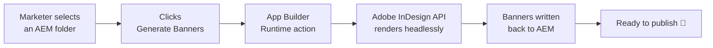

# 🎨 Banner Auto — on-brand banners at the speed of a spreadsheet

**One template. One CSV. Every size, every variation — rendered automatically, perfectly on-brand.**

Turn a single InDesign template and a row of content into a *complete* set of
production-ready banners — every ad size, every localized variant — without a
designer ever touching InDesign. The same design script runs on your laptop for
development and **headless in the cloud** via the Adobe InDesign API, so what you
prototype is exactly what ships.

---

## The problem this kills

Every campaign needs the *same* creative in a dozen shapes: leaderboard,
skyscraper, square, story, half-page, mobile banner… now multiply that by each
market, each headline, each hero image, each city. That's **hundreds of
hand-crafted files** per launch.

Today that means a designer in InDesign, resizing frames, re-flowing copy,
swapping images, and re-exporting — for hours — while the brand team waits. It's
slow, it doesn't scale, and every manual step is a chance to drift off-brand.

## The fix

```
   your InDesign template          your content (CSV)
   (the brand, locked in)          headline, city, hero, filename
            │                              │
            └──────────────┬───────────────┘
                           ▼
                 ┌───────────────────┐
                 │   Banner Auto      │   drives InDesign programmatically
                 │  generate_*.jsx    │   — the brand template is the source of truth
                 └───────────────────┘
                           ▼
        10 sizes × N variations, pixel-perfect, on-brand
        rendered as JPG + editable INDD — in seconds, unattended
```

- **The template holds the design.** Colors, type, spacing, logo lockups,
  grid — all governed by one InDesign file. Change the template, and *every*
  output updates. No copy-paste, no drift.
- **The CSV holds the content.** One row per variation: headline, city, hero
  image, output name. Add a row → get a full size-set for it.
- **The script does the work.** It lays out every size for every row, places the
  right imagery, fits the copy, and exports — deterministically, every time.

## The vision: one click, right inside AEM

The endgame is a **"Generate Banners" button in Adobe Experience Manager Assets.**

> A marketer opens an AEM folder that holds a template, a variations CSV, and the
> campaign images. They click **Generate Banners**. Moments later the finished,
> on-brand banners appear back in that same folder — ready to publish.

No design bottleneck. No tool handoff. No ticket queue. **Content velocity at
scale, with the brand guaranteed by the template.** The folder *is* the job:
drop in the ingredients, click once, collect the results.



---

## Why the approach is nice

- **Same script, local *and* cloud.** `generate_variations.jsx` runs identically
  on a desktop InDesign and on the Adobe InDesign API — the harness resolves its
  working directory from the script's own location, so there's **zero drift**
  between what you test and what runs in production.
- **Folder-as-key convention.** A job is just a folder: the `*template*.indd`,
  a variations CSV, a `*pagemap*` CSV, the images, and an `output/` folder. No
  config files, no database — the layout *is* the contract.
- **Cloud-native & serverless.** No InDesign desktop to install or babysit.
  Rendering happens on Adobe's infrastructure and scales with the work.
- **Governed by design, not by discipline.** On-brand output isn't a review
  step you hope people follow — it's a property of the template they can't
  bypass.
- **Zero dependencies.** The cloud harness is a single Node ≥ 18 file: no npm
  install, no supply chain, easy to audit and drop anywhere.

---

## How it works

| Layer | What it does |
|------|--------------|
| **`scripts/generate_variations.jsx`** | The engine. Reads the CSV, lays out all 10 sizes per row, places hero/lockup art, fits copy, exports JPG + INDD. |
| **`scripts/brand_lib.jsx`** | Shared library: size definitions, fonts, defaults, and the working-dir resolver that makes local == cloud. |
| **`scripts/build_template.jsx`** | Generates the master template from spec, so the design itself is reproducible. |
| **`cloud/run.mjs`** | The harness. Authenticates to Adobe IMS, registers the script as an InDesign *capability*, uploads inputs, runs the job, polls, and retrieves outputs. |
| **AEM Assets View extension** *(designed)* | The one-click UI: an Action Bar button that hands the selected folder to an App Builder Runtime action, which calls the InDesign API and writes results back to AEM. |

### Pipeline phases

```
Phase 1  Local render          ✅  proven — the .jsx produces the full size-set locally
Phase 2  Cloud render          🟡  harness ready (auth, --register, --submit); gated on API entitlement
Phase 3  AEM one-click         ⚪  designed — Runtime action + Assets View extension
```

---

## Quick start

**Local** — render the full set with a desktop InDesign:

```bash
./run_local.sh
```

**Cloud** — drive the Adobe InDesign API (Node ≥ 18, zero deps):

```bash
node cloud/run.mjs --dry-run      # assemble & print the exact plan — no credentials needed
node cloud/run.mjs --check-auth   # fetch an IMS token and report
node cloud/run.mjs --ping         # reachability probe against the InDesign API
node cloud/run.mjs --register     # register the script as an InDesign capability
node cloud/run.mjs --submit       # full run: auth → upload → execute → poll → download
```

Start with `--dry-run`: it writes `cloud/_dryrun/{inputs,outputs,job-payload}.json`
so you can see *exactly* what would be sent before a single credential is used.
See [`cloud/README.md`](cloud/README.md) for setup and the storage seam.

## The folder contract

A campaign folder contains everything a job needs — nothing more:

```
your-campaign/
├── brand-template.indd        # the design (filename contains "template")
├── variations.csv             # one row per banner variation
├── pagemap.csv                # size/page mapping (filename contains "pagemap")
├── hero-1.jpg, hero-2.jpg …   # imagery referenced by the CSV
└── output/                    # rendered JPG + INDD land here
```

Drop in the ingredients, run one command (or, soon, click one button) — collect
the results.

---

## Status & roadmap

This is an active build. The local pipeline is proven; the cloud harness is
complete and validated end-to-end against the live InDesign API; the one-click
AEM experience is designed and next in line once cloud rendering is entitled.

- [x] Reproducible template generation
- [x] Full local size-set rendering
- [x] Cloud harness: IMS auth, capability registration, job orchestration
- [ ] First headless cloud render (pending InDesign API / Firefly Services entitlement)
- [ ] App Builder Runtime action + storage wiring
- [ ] AEM Assets View "Generate Banners" extension

## Built with

Adobe InDesign · Adobe InDesign API (Firefly Services) · ExtendScript · Adobe IMS
· Node.js · Adobe Experience Manager · App Builder / Adobe I/O Runtime

---

*Brand-agnostic by design — bring your own template, fonts, and content.*
