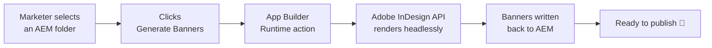

# 🎨 Banner Automation — on-brand banners (using the proper tool for the job)

**One template. One CSV. Every size, every variation — rendered automatically, perfectly on-brand.**

Turn a single InDesign template and a row of content into a *complete* set of
production-ready banners — every ad size, every localized variant — without a
designer ever touching InDesign. It runs **headless in the cloud** on the Adobe
InDesign API: no desktop app, no manual export, no workstation in the loop — a
whole campaign's worth of on-brand banners, rendered on demand.


<sub>Every banner above came from **one** InDesign template + a spreadsheet of variations — different placements, English/Spanish headlines, and multiple campaign versions. All output is brand-neutral sample content.</sub>

---

## The problem this kills

Every campaign needs the *same* creative in a dozen shapes: leaderboard,
skyscraper, square, story, half-page, mobile banner… now multiply that by each
market, each headline, each hero image, each city. That's **hundreds of
hand-crafted files** per launch.

Today that means a designer in InDesign, resizing frames, re-flowing copy,
swapping images, and re-exporting — for hours — while the brand team waits. It's
slow, it doesn't scale, and every manual step is a chance to drift off-brand.

## The fix

```
   your InDesign template          your content (CSV)
   (the brand, locked in)          headline, city, hero, filename
            │                              │
            └──────────────┬───────────────┘
                           ▼
                 ┌───────────────────┐
                 │   Banner Auto      │   drives InDesign programmatically
                 │  generate_*.jsx    │   — the brand template is the source of truth
                 └───────────────────┘
                           ▼
        every size × every variation, on-brand
        rendered as JPG + editable INDD — in seconds, unattended
```

- **The template holds the design.** Colors, type, spacing, logo lockups,
  grid — all governed by one InDesign file. Change the template, and *every*
  output updates. No copy-paste, no drift. The set of sizes is defined in the
  template, so any org can run **as many layout variations as it needs** —
  nothing here is fixed to a particular count.
- **The CSV holds the content.** One row per variation: headline, city, hero
  image, output name. Add a row → get a full size-set for it.
- **The script does the work.** It lays out every size for every row, places the
  right imagery, fits the copy, and exports — deterministically, every time.

## Why InDesign, and not Photoshop?

This same automation already exists in Photoshop, and Photoshop is superb at
image compositing. But a banner is, at its core, a **typographic layout
problem** — and that is exactly what InDesign is built to solve. Photoshop is a
raster image editor; InDesign is a professional page-layout and publishing
application. When copy has to fit, wrap, and stay on-brand across dozens of
sizes, that distinction is decisive.

**Superior text handling — the deciding factor**

- **A publication-grade text engine.** InDesign's paragraph composer, hyphenation
  and justification, optical kerning, baseline grids, and full OpenType control
  produce typesetting quality that Photoshop's type tool is not designed to match.
- **Overset detection.** An InDesign text frame *knows* when copy doesn't fit, so
  the automation can catch an over-long headline and flag it instead of silently
  shipping a broken layout. Photoshop has no equivalent notion of text that
  "doesn't fit."
- **Predictable copy-fitting.** Auto-sizing text frames and precise fitting rules
  mean headlines scale into their allotted space consistently across every size.

**A layout tool, purpose-built for this work**

- **Native multi-size documents.** However many banner sizes you need are simply
  that many pages — each with its own geometry — in a single document. That is
  InDesign's natural model; Photoshop leans on artboards, which are a weaker fit
  for distinct page sizes.
- **Centralized paragraph and character styles.** Brand typography is defined once
  and applied everywhere; change a style and every instance updates in lockstep.
- **Frame-based image fitting.** Placing artwork into defined frames (fill
  proportionally, auto-fit) is a first-class layout operation — precisely the
  banner use case.
- **Vector-first and resolution-independent.** Text and vector artwork stay crisp
  at any output size, rather than being baked into a fixed-resolution raster comp.

**Built for data-driven production**

- **Data Merge is a native InDesign capability.** "One template + one data source →
  many variations" is a canonical InDesign workflow, not a bolt-on.
- **Preflight for automated QA.** InDesign can validate a layout — missing fonts,
  overset text, low-resolution links — giving the pipeline built-in quality checks.
- **A truly editable deliverable.** The output `.indd` is a structured layout a
  designer can reopen and refine, not a flattened image.

> **In short:** Photoshop paints pixels; InDesign composes pages — and a banner is
> a page.

## The vision: one click, right inside AEM

The endgame is a **"Generate Banners" button in Adobe Experience Manager Assets.**

> A marketer opens an AEM folder that holds a template, a variations CSV, and the
> campaign images. They click **Generate Banners**. Moments later the finished,
> on-brand banners appear back in that same folder — ready to publish.

No design bottleneck. No tool handoff. No ticket queue. **Content velocity at
scale, with the brand guaranteed by the template.** The folder *is* the job:
drop in the ingredients, click once, collect the results.



---

## Why the approach is nice

- **Cloud-rendered and deterministic.** `generate_variations.jsx` runs headless
  on the Adobe InDesign API and resolves its own working directory, so the same
  job produces the same banners every time — no workstation, no manual setup,
  nothing to babysit.
- **Folder-as-key convention.** A job is just a folder: the `*template*.indd`,
  a variations CSV, a `*pagemap*` CSV, the images, and an `output/` folder. No
  config files, no database — the layout *is* the contract.
- **Cloud-native & serverless.** No InDesign desktop to install or babysit.
  Rendering happens on Adobe's infrastructure and scales with the work.
- **Governed by design, not by discipline.** On-brand output isn't a review
  step you hope people follow — it's a property of the template they can't
  bypass.
- **Zero dependencies.** The cloud harness is a single Node ≥ 18 file: no npm
  install, no supply chain, easy to audit and drop anywhere.

---

## How it works

| Layer | What it does |
|------|--------------|
| **`scripts/generate_variations.jsx`** | The engine. Reads the CSV, lays out every configured size per row, places hero/lockup art, fits copy, exports JPG + INDD. |
| **`scripts/brand_lib.jsx`** | Shared library: size definitions, fonts, defaults, and the working-dir resolver the cloud job relies on. |
| **`scripts/build_template.jsx`** | Generates the master template from spec, so the design itself is reproducible. |
| **`cloud/run.mjs`** | The harness. Authenticates to Adobe IMS, registers the script as an InDesign *capability*, uploads inputs, runs the job, polls, and retrieves outputs. |
| **AEM Assets View extension** *(designed)* | The one-click UI: an Action Bar button that hands the selected folder to an App Builder Runtime action, which calls the InDesign API and writes results back to AEM. |

### Pipeline phases

```
Phase 1  Rendering engine       ✅  proven — one template + CSVs → the full size-set
Phase 2  Cloud rendering        🟡  harness ready (auth, --register, --submit); gated on API entitlement
Phase 3  AEM one-click          ⚪  designed — Runtime action + Assets View extension
```

---

## See it in action


*One template, rendered across every placement — leaderboard, billboard, half-page,
med-rectangle, app card, social feed, story — in English and Spanish, in multiple
campaign versions. Change the template once and all of these regenerate.*

👉 **Want to build your own?** The [**examples/**](examples/README.md) folder is a
complete, brand-neutral walkthrough: author your template, write the variations
CSV and pagemap CSV, render, and collect the output — with the sample files used
above.

## Quick start

Drive the Adobe InDesign API from the cloud harness (Node ≥ 18, zero deps):

```bash
node cloud/run.mjs --dry-run      # assemble & print the exact plan — no credentials needed
node cloud/run.mjs --check-auth   # fetch an IMS token and report
node cloud/run.mjs --ping         # reachability probe against the InDesign API
node cloud/run.mjs --register     # register the script as an InDesign capability
node cloud/run.mjs --submit       # full run: auth → upload → execute → poll → download
```

Start with `--dry-run`: it writes `cloud/_dryrun/{inputs,outputs,job-payload}.json`
so you can see *exactly* what would be sent before a single credential is used.
See [`cloud/README.md`](cloud/README.md) for setup and the storage seam.

## The folder contract

A campaign folder contains everything a job needs — nothing more:

```
your-campaign/
├── brand-template.indd        # the design (filename contains "template")
├── variations.csv             # one row per banner variation
├── pagemap.csv                # size/page mapping (filename contains "pagemap")
├── hero-1.jpg, hero-2.jpg …   # imagery referenced by the CSV
└── output/                    # rendered JPG + INDD land here
```

Drop in the ingredients, run one command (or, soon, click one button) — collect
the results.

---

## Status & roadmap

This is an active build. The rendering pipeline is proven, and the cloud harness
is complete — IMS auth, capability registration, and job orchestration, verified
against the live InDesign API. The first end-to-end cloud render is gated on
Firefly Services entitlement; the one-click AEM experience is designed and next
in line.

- [x] Reproducible template generation
- [x] Full size-set rendering (one template → every placement)
- [x] Cloud harness: IMS auth, capability registration, job orchestration
- [ ] First headless cloud render (pending InDesign API / Firefly Services entitlement)
- [ ] App Builder Runtime action + storage wiring
- [ ] AEM Assets View "Generate Banners" extension

## Built with

Adobe InDesign · Adobe InDesign API (Firefly Services) · ExtendScript · Adobe IMS
· Node.js · Adobe Experience Manager · App Builder / Adobe I/O Runtime

---

*Brand- and size-agnostic by design — bring your own template, fonts, content,
and as many layout variations as you need.*
