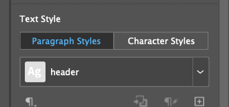
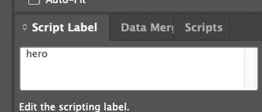

# Team Setup Guide — Banner Automation (InDesign API → AEM Assets View)

How to stand this up in **your own** IMS org + AEM environment. Each teammate
provisions their own org; nothing here is shared infrastructure.

**What you'll end up with:** a "Generate Banners" button in AEM Assets View. Select
a folder that holds an InDesign template + a variations CSV + a pagemap CSV +
images, click the button, and a full set of on-brand banners is rendered headless
by the Adobe InDesign API and written back into the folder's `output/` subfolder
(unpublished, for your review).

**Architecture:** AEM Assets View extension (button) → Adobe I/O Runtime action →
[read AEM folder → stage inputs to presigned storage → InDesign API renders →
write outputs back to AEM]. The engine is `cloud/aem-render.mjs`; the same logic
runs inside the Runtime action.

Estimated time once entitlements are in place: ~1–2 hours. The **entitlement**
(Part 1) is the long pole — start it first.

---

## Prerequisites

- Adobe employee, Node ≥ 18, `git`.
- An **IMS org** where you can get the Firefly Services product (Part 1).
- An **AEM as a Cloud Service** environment (dev/stage) you have Developer access to.
- **App Builder** access in that org + the `aio` CLI (`npm i -g @adobe/aio-cli`).
- An App Builder Runtime namespace (Adobe I/O Files is provisioned with it).
- The `magick` CLI (ImageMagick) only if you want to build showcase collages.

---

## Part 1 — Firefly Services entitlement (the gating step) ⏳

The InDesign API is part of **Firefly Services (FFS)**. Your IMS org must have the
FFS product, which lights up the **InDesign API** tile in Adobe Developer Console.

1. Open [Adobe Developer Console](https://developer.adobe.com/console) → create/pick
   a project → **Add API**. If **InDesign API** is greyed **"License required,"**
   your org isn't entitled yet.
2. Getting entitled (internal): Firefly Services is provisioned per org — work with
   your **business/GTM team** to get a demo org set up with Firefly Services, **or**
   use an existing demo/enablement org that already has it. There is also a lighter
   internal sandbox intake path — check your internal Firefly access documentation.
3. **Done when:** the InDesign API tile is selectable (not greyed) in Dev Console.

> This is the same gate as everything else — until the org has FFS, no InDesign
> API credential can be created. Don't burn time on later parts until this clears.

---

## Part 2 — Dev Console OAuth Server-to-Server credential

Custom-script registration on the InDesign API accepts **only** a Developer Console
**OAuth Server-to-Server** token (not an IMS service token).

1. Dev Console → your project → **Add API → InDesign API (Firefly Services)**.
2. Choose credential type **OAuth Server-to-Server**.
3. Record the **Client ID**, **Client Secret**, and the **Scopes** shown.
4. Note the environment: the **production** console (`developer.adobe.com`) →
   prod IMS + `https://indesign.adobe.io`. (A stage console → stage hosts.) The
   token env and the InDesign host must match, or you get `invalid_client` / 401.

---

## Part 3 — Durable input staging

The InDesign API fetches inputs from **URLs it can reach unauthenticated**. AEM
author can't serve those directly, and Runtime `/tmp` is private and
ephemeral, so the render action stages each input in Adobe I/O Files:

1. Add `@adobe/aio-lib-files` to the Runtime action (it is declared in
   `cloud/package.json`).
2. Let the action initialize the SDK with `init()`. App Builder injects the
   Runtime namespace credentials; do not paste an Azure SAS or storage key.
3. Upload under a unique per-run prefix and call
   `generatePresignURL(path, { expiryInSeconds: 3600 })`.
4. Delete the prefix after the InDesign job's outputs have been written to AEM.

The AEM engine implements this flow in `cloud/aem-render.mjs`. Adobe I/O Files
is durable enough for the lifetime of a render job and is externally reachable,
while `/tmp` remains useful only for local scratch work inside one container.

---

## Part 4 — AEM environment + auth (Service Credential)

You need the **author URL** and a **durable AEM credential** for the action.

1. **Cloud Manager** → your Program → **Environments** → open the target env's
   **Developer Console**. Note the **author URL**
   `https://author-p<program>-e<env>.adobeaemcloud.com`.
2. **Integrations** tab — two options:
   - **Quick test (ephemeral):** service **author** → **Get Local Development Token**
     → `accessToken`. Valid ~24h **and dies when your IMS login session changes**
     (aio login, incognito, etc.). Fine for a one-off CLI test, useless for the
     deployed action.
   - **Durable (use this for the extension):** **Service Credentials** → **Create
     service credentials** (provisions a technical account; ~3 per env limit).
     Downloads a JSON with a private key + `clientId`/`clientSecret`. The action
     signs a JWT and exchanges it for a fresh AEM token **every run** — no manual
     tokens, never expires.
3. **⚠️ Grant the technical account DAM WRITE access.** By default it can *read* but
   not *write*, so write-back fails with `403 initiateUpload`. In AEM author:
   **Tools → Security → Users** → find the tech account (search its clientId, e.g.
   `cm-p<prog>-e<env>-integration-0`) → add it to a group with `/content/dam` write
   (`administrators` works) → Save.

> The Service Credential is **per-env** — each env (dev/prod) needs its own + the
> DAM-write grant. The App Builder extension must be in **the same IMS org that owns
> the AEM env**, or it won't appear in that AEM's Assets View.

---

## Part 5 — Configure `cloud/.env`

```bash
cp cloud/.env.example cloud/.env
```
Fill in (never commit `.env` — it's gitignored):

```ini
# InDesign API — OAuth S2S (Part 2). Leave FFS_AUTH_CODE empty so client_credentials is used.
FFS_CLIENT_ID=<dev console client id>
FFS_CLIENT_SECRET=<dev console client secret>
FFS_AUTH_CODE=
FFS_ORG_ID=<your IMS org id, ...@AdobeOrg>
IMS_ENDPOINT=https://ims-na1.adobelogin.com/ims/token/v3     # prod
INDESIGN_API_BASE=https://indesign.adobe.io                  # prod (match the token env)
CAPABILITY_VERSION=1.0.0

# AEM (Part 4)
AEM_AUTHOR_URL=https://author-p<program>-e<env>.adobeaemcloud.com
AEM_DEV_TOKEN=<local development token>
```

---

## Part 6 — Register the capability

```bash
node cloud/run.mjs --check-auth     # should mint a bearer token
node cloud/run.mjs --register       # 201; prints an execution URL
```
Copy the execution URL into `cloud/.env` as `INDESIGN_EXECUTE_URL=…`.
(Re-registering later needs a NEW `CAPABILITY_VERSION`, else 422 "already exists.")

> **The script is baked into the capability.** `generate_variations.jsx` /
> `brand_lib.jsx` run from what you registered, **not** from what the job stages.
> Any change to those scripts only takes effect after you bump `CAPABILITY_VERSION`
> and `--register` again. (Staged inputs — template, CSVs, images, fonts — do
> update per run; the script does not.) The execution URL is keyed by capability
> name, so it usually stays the same across versions — no `.env` change needed.

---

## Part 7 — Build a job folder in AEM and run the engine

In AEM Assets, create a folder (this is the "key") containing:

| Item | Rule |
|------|------|
| InDesign template | filename contains **`template`**, ends `.indd` |
| Variations CSV | a `.csv` with a reserved `outputFileName` column plus content columns |
| Pagemap CSV | filename contains **`pagemap`** (`pagenumber,pagename`) |
| Hero images | the `.jpg/.png` referenced by the variations CSV |
| `fonts/` *(optional)* | per-job font files (`.otf/.ttf/.ttc/.woff2`) — override the shared set for this job |
| `output/` | an empty subfolder for results |

Then render (start with 1 row to smoke-test):

```bash
node cloud/aem-render.mjs --folder /content/dam/<program>/<job-folder> --run --max-rows 1
```

The engine reads + classifies the folder, stages inputs to Adobe I/O Files, executes
the InDesign API, and writes outputs back to `<folder>/output` **unpublished**.
Confirm they appear in AEM, then drop `--max-rows` for the full set.

### InDesign template contract

The `.indd` must contain one InDesign **page** for each output artboard/placement.
The automation does not infer content from layer names or from the visible page
name. Add Script Labels to the actual swappable page items:

| Page item | Script Label | Filled from |
|---|---|---|
| Image graphic frame | Any label you choose | the CSV column with the same header |
| Text frame | Any label you choose | the CSV column with the same header |

For **both image and text elements**, select the actual frame and open
**Window > Utilities > Script Label**, then enter the label in the Script Label
field. For example, an image frame might show `hero` and a text frame might show
`headline`. These are only examples; use any labels that match the CSV headers
exactly, including spaces and capitalization. The label must be on the image or
text frame itself, not only on a group, layer, or paragraph style. The
**Paragraph Styles** panel is separate: a paragraph style named `header` does
not set the Script Label for a text frame. Additional static design elements can
remain unlabeled. `outputFileName` is reserved for output naming and does not
need a frame.

The screenshots below show the difference:





The pagemap CSV is the authoritative page-to-artboard mapping:

```csv
pagenumber,pagename
1,WEB_LEADERBOARD_1000x320
2,WEB_HP_SLIDER_1440x500
3,WEB_BRAND_PAGE_BANNER_2880x900
```

`pagenumber` is the 1-based order of the page in the `.indd` (page 1, page 2,
page 3, and so on). `pagename` is the output artboard name: it prefixes rendered
filenames and is also used to look up an optional paragraph-style group with the
same name. Keep one row for every InDesign page, in the same order; do not use
the InDesign page's displayed name as a substitute for `pagename`. If a page is
missing from the CSV, the exporter falls back to a padded number such as `01`,
but that page will not have the intended artboard name.

**Fonts.** The render environment only has the fonts you ship with the job (they
land in a `Document Fonts/` folder next to the template, which InDesign
auto-activates). Adobe Fonts are present on the servers, but bundling guarantees
exact output and is **required for any non-Adobe brand font**.

- **CLI harness:** drop font files in `cloud/fonts/` — bundled automatically
  (ships Source Sans 3, OFL, by default).
- **AEM button:** create a shared **`/content/dam/fonts`** folder (change the path
  with the `AEM_FONTS_PATH` action input) and drop your brand fonts there once —
  every job picks them up. A per-job `fonts/` subfolder overrides the shared set
  for that job (per-job wins on a filename clash).
- The files you drop in must be the **exact families and styles the template
  references** (e.g. `Source Sans 3` *Medium* and *Bold* as discrete static
  fonts). A folder full of *other* fonts doesn't help — InDesign matches by
  family + style and substitutes anything it can't find.
- Each render preflights the template's fonts and records their status
  (`installed` / `substituted` / `not_available`) in `result.json` and
  `_run_log.txt`; anything not installed is flagged as a warning, so a missing
  font surfaces instead of silently changing the output. **Always check the run
  log's `fonts (...)` block after a render** — `substituted` means the wrong type
  shipped even though the render "succeeded".
- ⚠️ **Licensing:** uploading font files to a cloud render service requires a
  license that permits server/cloud use. Adobe Fonts sidestep this; most custom
  foundry licenses do not — check before bundling.

---

## Part 8 — App Builder extension (the "Generate Banners" button)

This has several non-obvious gates. In order:

**1. Enable Assets View UI Extensibility for your IMS org (the hidden gate).**
A published extension will **not** appear until this Adobe-side feature toggle is on
for your IMS org. Request it in the internal **`#dx-ui-extensibility`** Slack channel
with your IMS org id, AEM env(s), and extension point `aem/assets/assetsview/1`.
(Assets Ultimate; internal/eval orgs can be enabled too.) There is **no `aio` way to
check this** — if Extension Manager shows nothing for Assets View, it's not enabled.

**2. Scaffold.**
```bash
aio login          # pick the org that owns your AEM env
aio app init aem-extension
```
Templates → **All Extension Points** → **`@adobe/aem-assets-assetsview-ext-tpl`**
(`aem/assets/assetsview/1`). Add an **ActionBar action** (with a **modal**) and a
**server-side handler** (the Runtime action).

**3. Wire the action** (`ext.config.yaml` inputs, values from
`aem-extension/.env`): use `aem-extension/.env.example` as the template and
provide the FFS OAuth S2S creds and `INDESIGN_EXECUTE_URL` from your own
Developer Console project and base64 Service Credential (`AEM_SC_JSON`). The
AEM author URL must also be set in `aem-extension/.env` as
`AEM_AUTHOR_URL=https://author-p<program>-e<env>.adobeaemcloud.com`. Assets View
metadata may override it when available, but the env value is required as the
deployment fallback. Set
**`require-adobe-auth: false`** — with it `true`, aio deploys only `__secured_*`
without the public route in some namespaces, so the action URL **404s**. Raise the
action `limits.timeout` (renders take minutes).

At runtime the extension first looks for the current author URL in the Assets
View host/resource metadata and passes it to the action. This avoids relying on
environment IDs such as `p59602` or `e520244` when Assets View exposes the
metadata. Keep `AEM_AUTHOR_URL` configured as a fallback because some hosts do
not provide it. Ensure the Service Credential has access to the configured
environment the deployment may use.

**4. Deploy + publish.**
```bash
aio app use -w Production && aio app deploy   # merge (m) .env/.aio when asked
```
Then **publish/approve in Adobe Exchange** (NOT Developer Console):
**`exchange.adobe.com/manage`** → **App Builder applications** → your app →
**Approve** (needs org **System Admin**). If the org/app doesn't show, **sign out of
Exchange + reopen in incognito + pick the right org**. Approval flips it from
"In review / DRAFT" to **Published**.

**5. Enable the extension per-environment** in **Extension Manager** (EM SPA).

The **Generate Banners** button then appears in that env's Assets View when an
`.indd` is selected.

### Faster dev loop (skip the publish cycle)
Republishing on every change is painful. Deploy to **Stage** (no approval) and inject
the build via a preview URL:
```
https://experience.adobe.com/?devMode=true&ext=<STAGE …adobeio-static.net/index.html>?v=N&repoId=<author host>#<assets-view hash>
```
- `adobeio-static.net` **caches `index.html`** → **bump `?v=N`** every deploy to bust it.
- The modal **fires the render and returns immediately** ("Generation started"); the
  render runs for minutes server-side and lands in AEM. Web actions can't hold a
  synchronous HTTP response that long (you'd get "Response not yet ready"), so this
  fire-and-forget UX is by design.

---

## Troubleshooting

| Symptom | Cause / fix |
|---|---|
| InDesign API greyed **"License required"** | Org lacks FFS — Part 1. |
| Token error **`invalid_client`** | Prod vs stage mismatch — token env must match `IMS_ENDPOINT` + `INDESIGN_API_BASE`. |
| `--register` → **422 already exists** | Bump `CAPABILITY_VERSION`. |
| Job fails **"Script didn't return anything"** | Capability-script contract — no `#target`, return a JSON package with `assetsToBeUploaded` + `dataURL`, avoid desktop-only API calls. |
| AEM write-back **"fetch failed …comundefined"** | Direct-binary upload: bare block `PUT` (no `x-ms-blob-type`); build the complete URL as `<folder>.completeUpload.json` yourself. |
| `aio app init` **"No organizations found"** | `aio logout --force` then `aio login --force`; sign out of Adobe in the browser first and pick the **enterprise** profile. |
| Extension not visible in Assets View | (1) org-level UI Extensibility toggle not enabled — request in `#dx-ui-extensibility`; (2) not **Published** — approve in Exchange Manage; (3) not enabled per-env in **Extension Manager**; (4) wrong org. |
| Action URL **404 "resource does not exist"** | `require-adobe-auth: true` deployed only `__secured_*` — set it `false` and validate in-action. |
| Modal: **`getAccessToken()` times out** | Auth API is unreliable from the modal's `attach()` connection — authenticate in the action via a **Service Credential**, not the browser token. |
| AEM **401 "access token invalid/expired"** | A local dev token died with a session change — use a **Service Credential** (Part 4). |
| AEM **403 `initiateUpload`** on write-back | Tech account lacks DAM write — add it to a DAM-write group (Part 4, step 3). |
| Stale bundle / empty modal after deploy | `adobeio-static` caches `index.html` — bump the `?v=` cache-buster on the preview URL. |
| **"Response not yet ready"** | Render exceeded the ~60s sync HTTP window — expected; the action finishes async and writes to AEM (fire-and-forget UX). |
| Output uses the **wrong font** (looks "close but off") | Font substituted, not installed — the exact family+style isn't in `/content/dam/fonts` (or the per-job `fonts/`). Check the run log's `fonts (...)` block; add the discrete static weights the template references. |
| Render fails **"Returned data file (dataURL) is not JSON"** | The script wrote an unescaped control char (e.g. InDesign's tab-delimited `Font.name`) into `result.json`. Escape `\t`/`\r`/`\n` in the JSON writer, then bump `CAPABILITY_VERSION` and re-`--register`. |
| Script change (fonts, `.indd` output, layout) **had no effect** | The capability runs the *registered* script, not the staged one — bump `CAPABILITY_VERSION` and `--register` again (Part 6). |

---

## Reference

- `cloud/run.mjs` — auth, `--register`, capability bundling.
- `cloud/aem-render.mjs` — the folder-driven engine (read → stage → render → write-back).
- `cloud/AEM-EXTENSION-DESIGN.md` — full design + verified API mechanics (local/internal).
- `examples/` — a brand-neutral worked example (template contract, sample CSVs).
